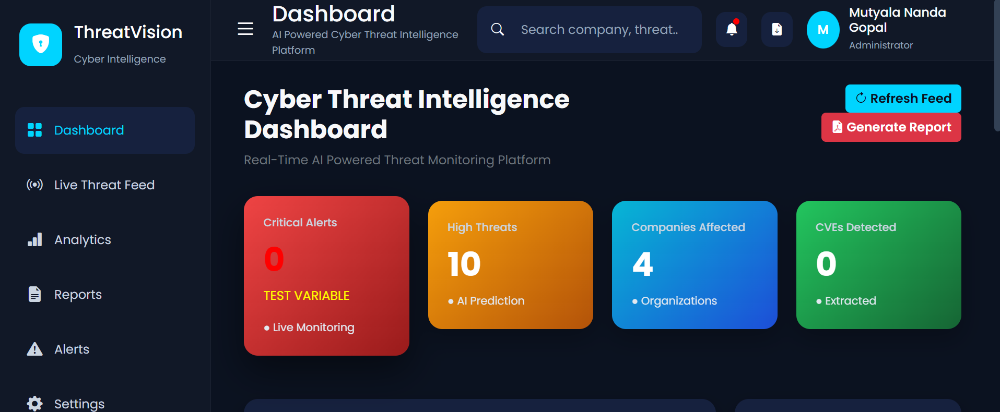
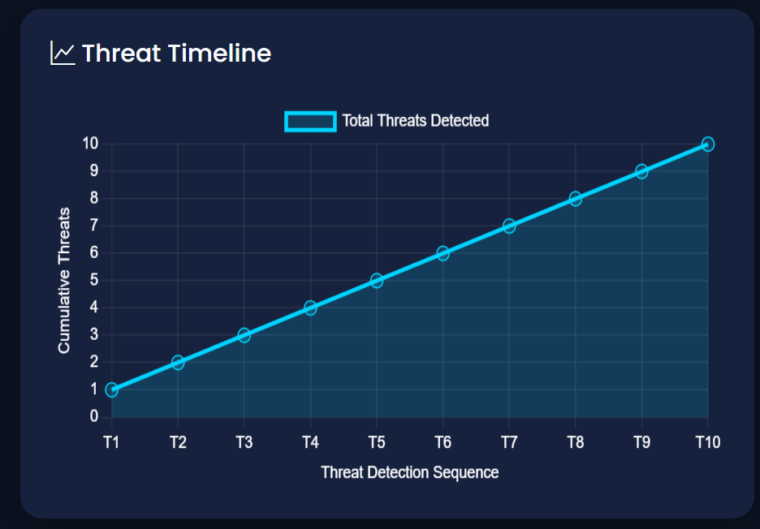
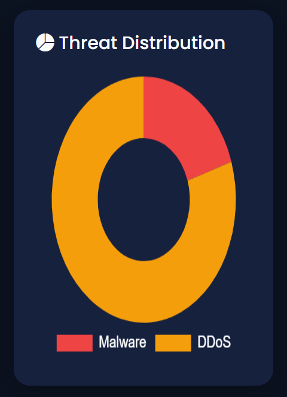
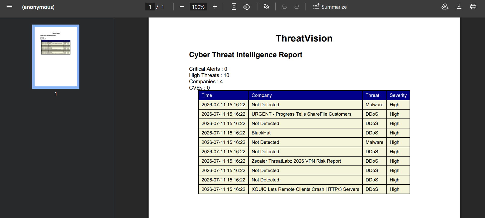
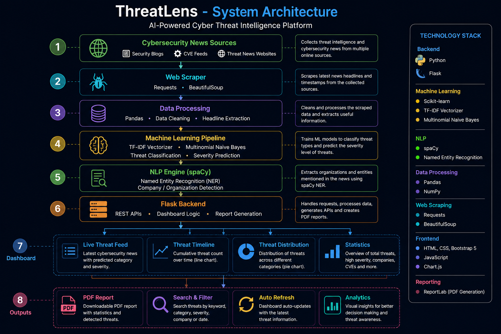

# ThreatLens

An AI-powered Cyber Threat Intelligence Platform that collects cybersecurity news, classifies threats using machine learning, extracts organizations with Natural Language Processing (NLP), and visualizes security insights through an interactive Flask dashboard.

---

## Overview

ThreatLens is designed to automate the analysis of cybersecurity news by combining web scraping, machine learning, and NLP techniques. The platform processes recent security headlines, identifies the type and severity of threats, detects affected organizations, and presents the results through an interactive dashboard with charts and downloadable reports.

The project demonstrates the integration of backend development, machine learning, data visualization, and cybersecurity concepts in a single application.

---

## Features

- Real-time cybersecurity news collection
- Machine Learning based threat classification
- Severity prediction for detected threats
- Organization extraction using spaCy NLP
- Interactive dashboard with live statistics
- Threat Distribution visualization
- Cumulative Threat Timeline
- Search and filtering
- PDF report generation
- REST API endpoints
- Automatic dashboard refresh

---

## Technology Stack

### Backend

- Python
- Flask

### Machine Learning

- Scikit-learn
- TF-IDF Vectorizer
- Multinomial Naive Bayes

### NLP

- spaCy

### Data Processing

- Pandas
- NumPy

### Frontend

- HTML
- CSS
- Bootstrap 5
- JavaScript
- Chart.js

### Web Scraping

- BeautifulSoup
- Requests

---

## Project Structure

```
ThreatLens/
│
├── data/
├── ml/
├── nlp/
├── reports/
├── scraper/
├── static/
│   ├── css/
│   ├── js/
│   └── images/
├── templates/
├── flask_app.py
├── requirements.txt
└── README.md
```

---

## 📷 Dashboard Preview

### Main Dashboard

<p align="center">
  
</p>

---

### Threat Timeline

<p align="center">
  
</p>

---

### Threat Distribution

<p align="center">
  
</p>

---

### Generated PDF Report

<p align="center">
  
</p>
---

## REST APIs

| Endpoint | Description |
|----------|-------------|
| `/api/news` | Returns processed threat data |
| `/api/stats` | Dashboard statistics |
| `/api/threats` | Threat distribution |

---

## Installation

Clone the repository

```bash
git clone https://github.com/nandagopalmutyala/ThreatLens.git
```

Move into the project directory

```bash
cd ThreatLens
```

Install dependencies

```bash
pip install -r requirements.txt
```

Run the application

```bash
python flask_app.py
```

Open your browser

```
http://127.0.0.1:5000
```

---

## Future Enhancements

- Interactive world map for cyber incidents
- Threat trend prediction using deep learning
- User authentication
- Email alerts
- Cloud deployment
- Database integration
- Historical analytics
- Multi-source intelligence feeds

---

## Author

**MUTYALA NANDA GOPAL**

Electronics and Communication Engineering

CVR College of Engineering

GitHub

https://github.com/nandagopalmutyala

LinkedIn

https://www.linkedin.com/in/nanda-gopal-mutyala-3875663b4

---

## System Architecture

The following diagram illustrates the end-to-end workflow of ThreatLens, from collecting cybersecurity news to generating actionable insights through machine learning, NLP, and an interactive dashboard.

<p align="center">
  
</p>

## License

This project is intended for educational and learning purposes.
